# Top 28 Online Course Platforms Rankings in 2025 (Comprehensive Review)

Creating and selling online courses used to require piecing together separate tools for hosting videos, processing payments, managing students, and delivering content—a technical nightmare that distracted from actually teaching. Modern course platforms changed everything by bundling these essentials into unified systems where you upload content, customize branding, set pricing, and start selling within hours rather than weeks. Whether you're an independent creator launching your first course, a business training employees, or an institution managing thousands of learners, today's e-learning platforms deliver complete solutions handling everything from interactive video players and quizzes to automated certificates and detailed analytics at price points ranging from free to enterprise.

***

## **[LearnWorlds](https://www.learnworlds.com)**

Advanced course platform emphasizing interactive video experiences and social learning features, perfect for creators wanting engagement beyond basic video delivery.

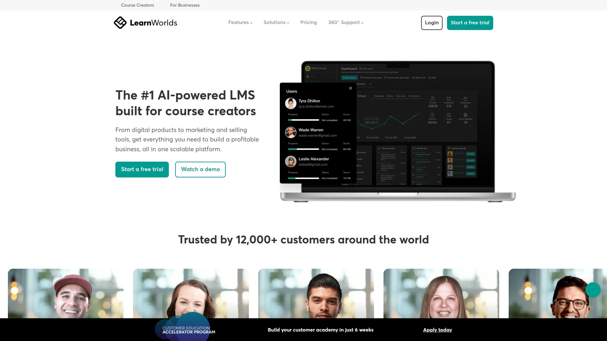

LearnWorlds stands out through its interactive video builder that transforms passive watching into active learning. You can embed quizzes directly inside videos, add clickable buttons triggering actions, insert transcripts automatically, and create branching scenarios where video flow changes based on learner responses. This interactivity dramatically improves completion rates and knowledge retention compared to standard lecture formats.

The customizable course player gives complete control over appearance, letting you adjust layouts, colors, and navigation to match your brand. You can even create Netflix-style browsing experiences where students explore content visually. Built-in community features include discussion boards, social learning tools with comments and likes, and private messaging between learners. While not as robust as dedicated community platforms, these tools foster connections directly within your learning environment.

Assessment capabilities extend beyond simple multiple choice with gamified questions, fill-in-the-blanks, video assignments, file submissions, and custom completion rules defining when activities count as finished. The SCORM compliance allows importing existing e-learning content. Mobile apps for iOS and Android let students access courses anywhere. Marketing tools include customizable landing pages, coupon systems, and payment gateway integrations supporting Stripe, PayPal, and regional options.

The AI assistant helps create course outlines, assessments, and marketing materials using advanced technology. Recent interface updates streamlined workflows making course creation faster. Pricing starts at accessible monthly rates with different tiers unlocking features like removal of LearnWorlds branding, increased student capacity, and advanced integrations.

***

## **[Teachable](https://teachable.com)**

Beginner-friendly platform emphasizing simplicity and guided setup processes, ideal for creators prioritizing ease of use over advanced customization.

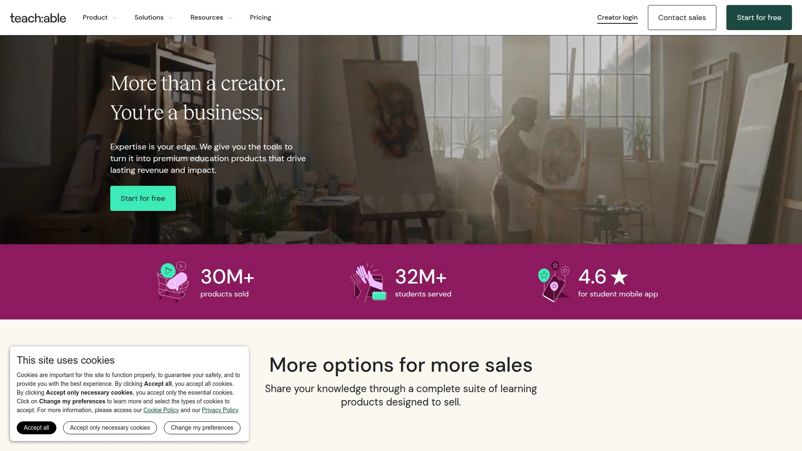

Teachable excels at straightforward course delivery with setup wizards guiding you through essential steps. The platform removes technical complexity, letting non-technical creators launch professional courses quickly. Course building tools provide templates and structured workflows reducing decisions about page layouts and navigation.

Payment processing integrates Stripe and PayPal with options for one-time purchases, payment plans, and subscriptions. The Basic plan charges transaction fees while higher tiers eliminate these costs. Sales pages and checkout experiences come pre-built requiring minimal customization. Student management tracks enrollments, progress, and completion automatically.

Quiz creation supports multiple question types though options feel more limited compared to specialized platforms. Certificates issue automatically upon course completion with basic customization. The platform handles EU VAT MOSS tax requirements automatically, beneficial for creators selling internationally. Email marketing capabilities exist but remain basic, often requiring external tools for sophisticated campaigns.

Pricing remains competitive particularly for European sellers needing tax compliance. The interface prioritizes simplicity sometimes at the expense of advanced features power users want. For creators wanting to focus on content rather than platform configuration, Teachable delivers streamlined experience.

***

## **[Thinkific](https://thinkific.com)**

Flexible course platform offering unlimited courses on all paid plans with zero transaction fees and powerful customization for growing course businesses.

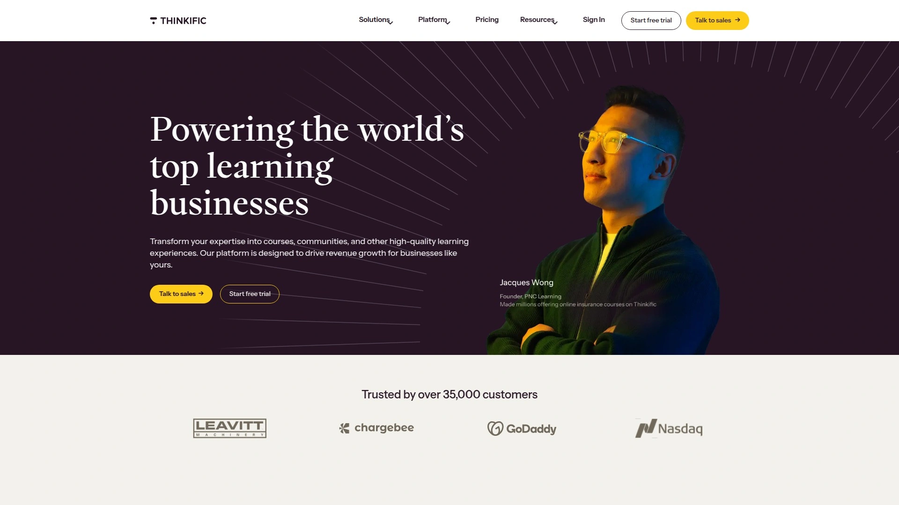

Thinkific provides generous features across pricing tiers including unlimited courses even on basic paid plans. The zero transaction fee structure means you keep more revenue compared to platforms taking percentage cuts. This pricing approach suits creators planning multiple courses or expecting significant sales volume.

Course builder flexibility allows creating diverse content types including videos, PDFs, quizzes, assignments, and live lessons. Bulk course enrollment helps corporate clients or schools adding multiple students simultaneously. The quiz engine supports varied question formats with partial credit scoring and question banks. Drip content scheduling releases lessons over time maintaining engagement and preventing binge consumption.

Customization options extend to branded websites, custom domains, and theme editing letting you match courses to existing brand identity. Payment options include Stripe and PayPal integration with support for payment plans, subscriptions, and one-time purchases. Affiliate tracking helps recruit promoters expanding reach.

The platform provides solid analytics tracking student progress, course performance, and revenue metrics. Community features remain basic, often requiring external platforms for robust discussion forums. Free plan limitations include Thinkific branding and restricted features but serve for testing before commitment. Paid plans scale from solopreneur needs to business requirements with team collaboration tools.

***

## **[Kajabi](https://kajabi.com)**

All-in-one platform combining course hosting with marketing automation, email campaigns, and sales funnels eliminating need for multiple tool subscriptions.

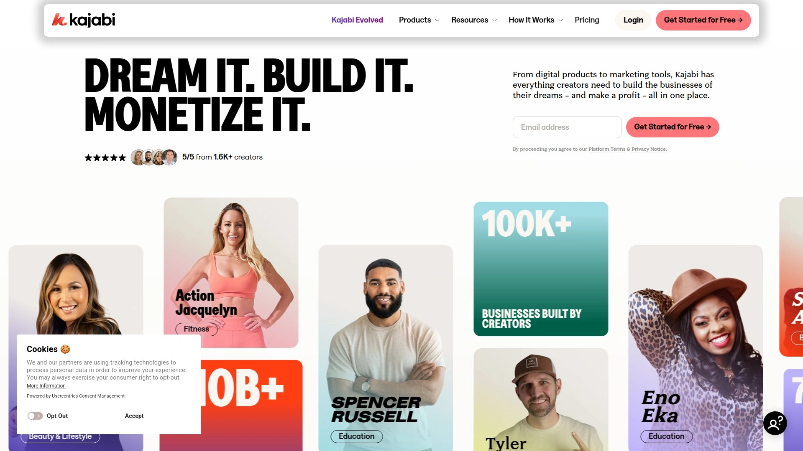

Kajabi positions as complete business platform rather than just course hosting. Built-in email marketing includes automation sequences, segmentation, and broadcast messaging without external email services. Sales funnel builder creates landing pages, checkout flows, and upsell sequences maximizing revenue per customer. Pipeline tracking visualizes customer journeys from awareness through purchase.

The integrated approach saves money compared to combining separate course platform, email service, and funnel builder subscriptions. Many creators report $300+ monthly savings consolidating tools. Marketing templates provide starting points for campaigns, funnels, and pages tested across industries. Advanced monetization features enable upsells, order bumps, and flexible pricing structures including trials and payment plans.

Course delivery includes multimedia support, quizzes, and assessments with certificates. The Kajabi app extends learning to iOS and Android devices. Community features allow discussion areas within your Kajabi site. Analytics dashboard tracks student engagement, course completion, and business metrics.

The downside remains pricing starting at $119 monthly, significantly higher than alternatives. The Basic plan limits courses to three, requiring upgrades as your catalog grows. For creators treating courses as a business requiring marketing infrastructure, Kajabi's higher cost justifies its comprehensive capabilities. Beginners might find the features overwhelming compared to simpler platforms.

***

## **[Podia](https://podia.com)**

Creator-focused platform bundling courses, digital downloads, memberships, and email marketing at transparent pricing without transaction fees.

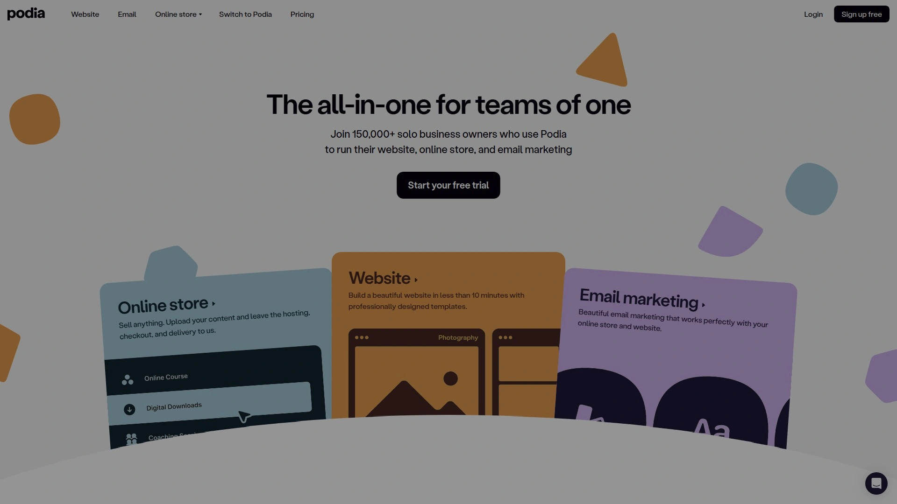

Podia simplifies selling multiple product types through one platform. Beyond courses, you can sell digital downloads like ebooks or templates, create membership subscriptions with recurring content, and offer coaching services. This flexibility suits creators building diversified income streams.

Email marketing capabilities come built-in with broadcasts and automated sequences triggered by customer actions. Unlike platforms requiring external email tools, Podia handles basic campaigns internally though advanced users may still prefer dedicated email services. The affiliate system lets customers promote your products earning commissions, expanding reach through word-of-mouth.

Course features include drip scheduling, pre-launch modes, various content types, completion certificates, and upsell opportunities. Integration with calendar apps like Calendly, SavvyCal, and YouCanBookMe streamlines booking coaching sessions. Payment processing supports Stripe and PayPal without transaction fees on any plan.

Community tools feel basic compared to specialized platforms, focusing on simple forums rather than advanced social features. The tradeoff benefits creators wanting integrated simplicity over best-in-class community functionality. Pricing starts affordably with 14-day free trial eliminating risk. The straightforward interface makes onboarding quick even for non-technical users.

***

## **[Mighty Networks](https://mightynetworks.com)**

Community-first platform emphasizing connections and interactions alongside courses, ideal when member relationships matter as much as content delivery.

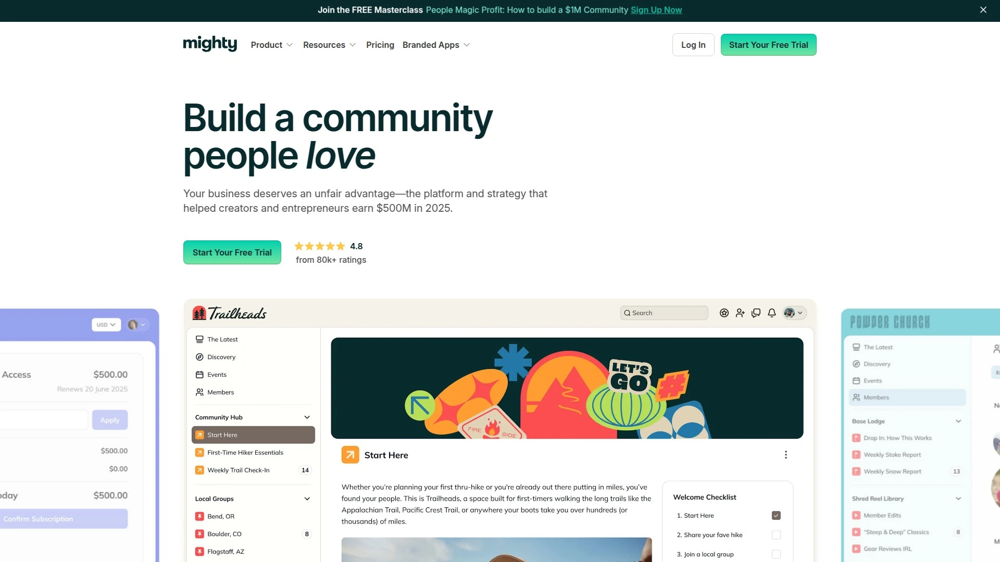

Mighty Networks prioritizes community building with features like member profiles, direct messaging, live chat, activity feeds, and interest-based connections. This social approach transforms courses from isolated learning into collaborative experiences. Members engage through posts, reactions, and discussions creating peer learning dynamics.

Spaces functionality organizes community areas around topics, courses, events, and resources. You can create dedicated spaces for course modules, discussion topics, live events, and member directories. Space groups bundle related spaces under common themes improving navigation. The chat feature reduces communication friction compared to asynchronous-only platforms.

Course delivery integrates directly into community spaces rather than existing as separate products. This architecture keeps learners engaged in community while accessing lessons. Events hosting includes live streaming, ticketing, and registration management. The mobile app ensures members stay connected on iOS and Android devices.

However, course creation tools feel less sophisticated than dedicated course platforms, lacking advanced quiz types and drip scheduling found elsewhere. The focus remains community over pure course functionality. Pricing starts higher than basic course platforms reflecting the community features. Best suited for creators believing community drives value as much as course content itself.

***

## **[TalentLMS](https://talentlms.com)**

Affordable learning management system designed for businesses and teams needing training delivery with SCORM support and free plan for unlimited time.

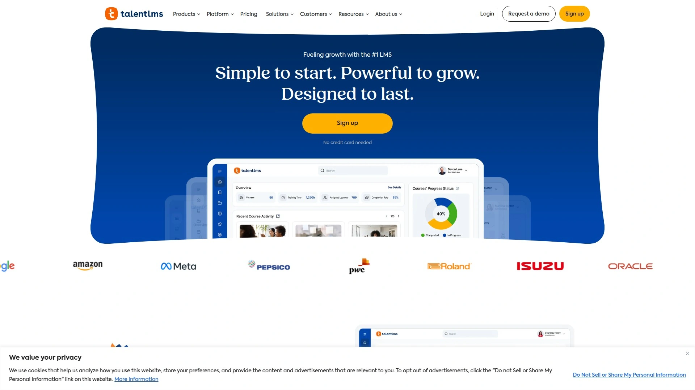

TalentLMS targets small businesses and corporate training scenarios rather than individual course creators. The free plan accommodates up to 5 users and 10 courses indefinitely, perfect for small teams testing LMS capabilities. Paid plans scale affordably as user counts grow.

SCORM compliance allows importing standardized e-learning content from authoring tools. This interoperability suits organizations with existing training materials needing compatible hosting. Course creation supports videos, documents, presentations, and SCORM packages. Assessment engine includes quizzes, assignments, and surveys with detailed reporting.

Gamification features like points, badges, and leaderboards increase engagement particularly for employee training scenarios. Certification management issues and tracks credentials with expiration dates for compliance training. Reporting provides insights into completion rates, assessment scores, and individual learner progress.

Integrations connect with popular tools including Salesforce, Slack, Zoom, and Zapier automating workflows. The ecommerce functionality allows selling courses though it feels secondary to the core training focus. White-label branding removes TalentLMS logos creating branded learning portals. API access enables custom integrations.

***

## **[Udemy](https://udemy.com)**

Global course marketplace connecting instructors with millions of students, offering built-in audience but limiting pricing control and branding.

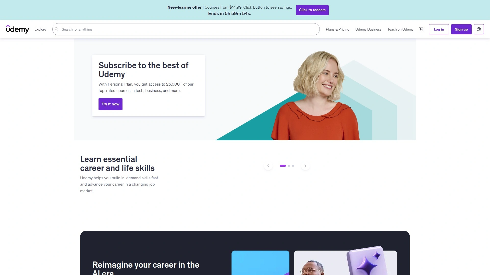

Udemy operates as marketplace where instructors publish courses accessing Udemy's massive student base. This built-in traffic eliminates cold-start problems plaguing independent creators. Students browsing Udemy discover your courses through search and recommendations without you building an audience first.

The tradeoff involves surrendering control over pricing, branding, and student relationships. Udemy frequently runs sitewide promotions drastically discounting courses without instructor approval. You can't access student email addresses limiting ability to build direct relationships. Course pages follow Udemy's template with minimal customization.

Course creation tools provide video uploads, quizzes, assignments, and resources. Udemy handles payment processing, student management, and technical infrastructure. The revenue split gives instructors 50% of organic sales and 25% of promotional sales. This structure works for instructors prioritizing passive income over building personal brands.

Competition proves intense with over 200,000 courses on the platform. Standing out requires either niche topics, exceptional production quality, or strong existing reputations. The marketplace model suits subject matter experts wanting to teach without managing platform operations or marketing.

***

## **[Coursera](https://coursera.org)**

Academic-focused platform partnering with universities and companies delivering accredited courses, certificates, and degrees valued by employers.

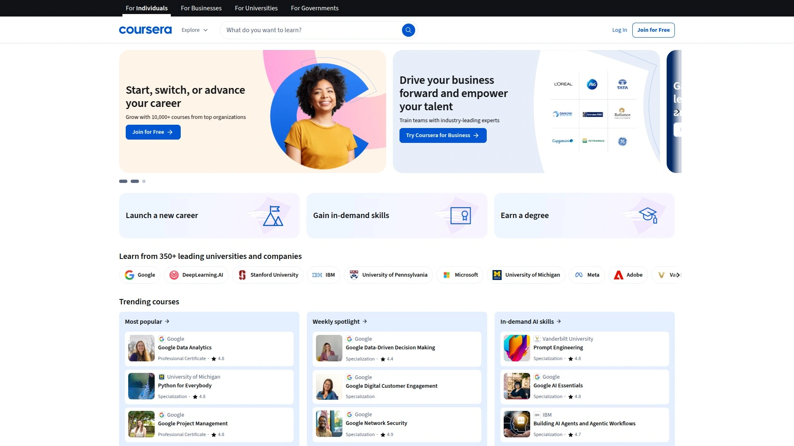

Coursera emphasizes formal credentials through partnerships with top universities like Yale, Stanford, and companies like Google and IBM. Courses often culminate in recognized certificates or even full degrees adding resume value. This academic rigor attracts learners seeking career advancement rather than casual skill building.

Subject matter covers professional development, technical skills, business topics, and academic disciplines taught by university professors and industry experts. Production quality generally exceeds casual platforms with professionally filmed content. Assessment includes graded assignments and peer reviews mimicking traditional education.

Subscription pricing offers unlimited access to thousands of courses for monthly fee. Individual courses can be audited free or purchased for certificates. The specialization structure bundles related courses into learning paths culminating in capstone projects. Degrees available through university partners require larger time and financial commitments.

As a learner platform, Coursera doesn't enable independent creators selling courses. Instructor positions require university or company partnerships making it inaccessible to most individual experts. For learners prioritizing recognized credentials, Coursera delivers employer-respected certifications.

***

## **[Skillshare](https://skillshare.com)**

Creative skills marketplace emphasizing project-based learning with subscription access to thousands of classes in design, photography, business, and creative fields.

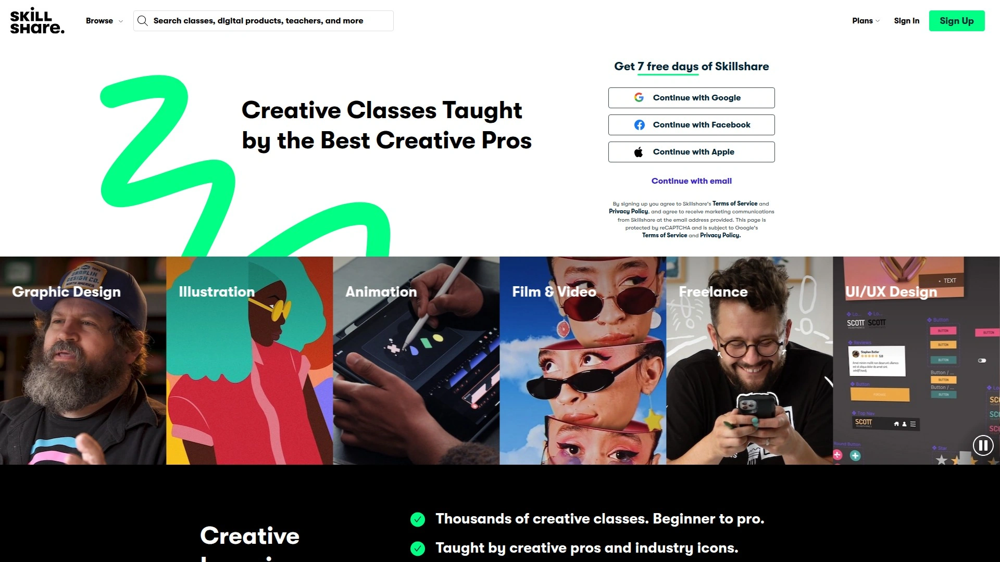

Skillshare focuses on creative and professional skills rather than academic subjects. Classes cover photography, graphic design, illustration, writing, marketing, productivity, and entrepreneurship. The project-based approach emphasizes creating work rather than passive consumption.

Subscription model charges annual or monthly fees granting unlimited class access. This all-you-can-learn approach encourages exploration across topics without per-course purchases. Skillshare Originals represent in-house productions with thought leaders offering higher production values.

For creators, Skillshare pays based on minutes watched rather than per-course sales. This royalty structure rewards engaging content keeping students watching. However, earnings can feel unpredictable compared to platforms with direct pricing control. Content guidelines ensure quality though acceptance isn't guaranteed.

Classes typically run shorter than comprehensive courses focusing on specific techniques or projects. This format suits learners wanting quick skill acquisition over deep expertise. The community aspect includes class projects where students share work receiving peer feedback. Mobile apps enable learning anywhere.

***

## **[LinkedIn Learning](https://www.linkedin.com/learning)**

Professional development platform integrated with LinkedIn profiles, offering expert-taught courses in business, technology, and creative skills with career-focused recommendations.

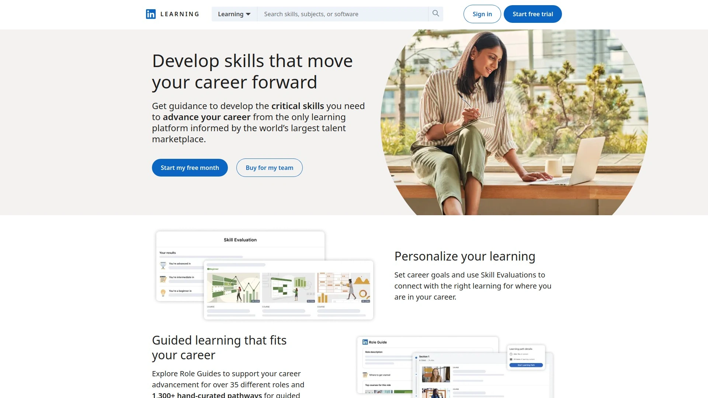

LinkedIn Learning, formerly Lynda.com, connects directly to your LinkedIn profile providing personalized course recommendations based on career goals and skills gaps. Completing courses adds certificates to your LinkedIn profile visible to recruiters and connections. This integration makes learning outcomes professionally visible.

Course library spans business communication, management, marketing, technology, software training, and creative skills taught by industry professionals. Video quality and instruction maintain high standards with expert practitioners rather than academics. Transcripts accompany videos improving accessibility.

Subscription pricing offers monthly or annual access to full catalog. Some employers provide free access through organizational licenses. Learning paths bundle related courses addressing specific career objectives like transitioning to project management or mastering data analysis.

As a learner-only platform, individuals can't create and sell courses. The focus remains consuming content rather than producing it. For professionals seeking recognized skills training directly tied to career advancement, LinkedIn Learning delivers relevant content with built-in credibility.

***

## **[Docebo](https://docebo.com)**

Enterprise LMS emphasizing AI-powered learning delivery, scalability for large organizations, and comprehensive integration capabilities for corporate training programs.

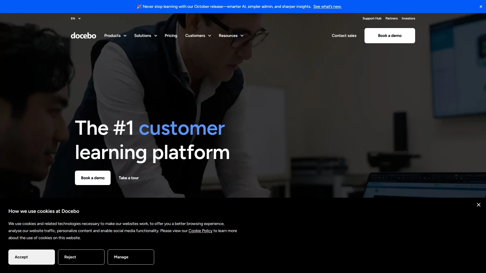

Docebo targets large enterprises requiring sophisticated learning management at scale. AI features include automatic content recommendations, personalized learning paths, virtual coaching, and auto-tagging reducing administrative burden. These intelligent systems adapt to learner behavior improving engagement.

Integration capabilities span over 400 business tools including Salesforce, Workday, Microsoft Teams, Zoom, and payment gateways. Native Salesforce integration links learning outcomes directly to CRM data connecting training to business performance. This connectivity suits organizations with complex tech stacks.

The platform handles customer education, partner enablement, and employee training through single interface. Multi-domain support manages training for clients, partners, and employees under separate branding. Social learning tools and content curation encourage knowledge sharing beyond formal courses.

Mobile learning through Go.Learn app extends training beyond desktop. SCORM compliance and xAPI support accommodate various content formats. Comprehensive reporting and analytics track learner progress, engagement, and training ROI. However, pricing starts significantly higher than SMB-focused platforms and often requires dedicated IT support for setup.

***

## **[Moodle](https://moodle.org)**

Open-source learning platform offering maximum customization and control, popular with educational institutions and organizations wanting self-hosted solutions without licensing fees.

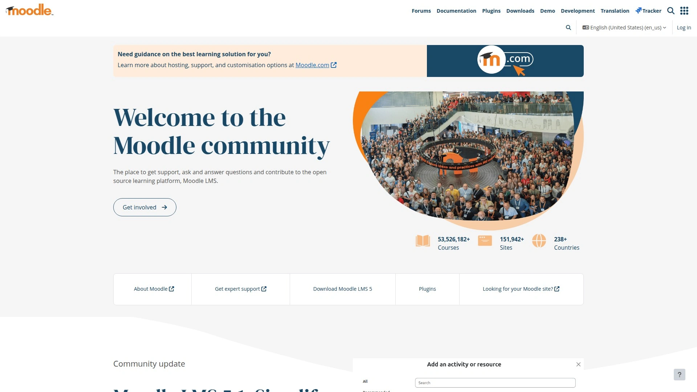

Moodle provides completely free open-source software deployable on your own servers eliminating recurring platform fees. This ownership appeals to institutions and organizations prioritizing data control and cost containment. Customization possibilities prove nearly unlimited through coding and plugins.

Features include course management, multimedia content support, forums, quizzes, assignments, grading, and certificates. Extensive plugin ecosystem adds functionality like attendance tracking, video conferencing, and specialized assessment types. SCORM compliance ensures content portability.

The collaborative development model means worldwide community contributes improvements and extensions. Documentation and community support prove extensive though sometimes technical. Many universities and large organizations run Moodle for thousands of concurrent users.

However, the technical expertise required for setup, hosting, maintenance, and security updates exceeds most non-technical users. Hidden costs emerge through server hosting, IT staff time, and potential consultant fees. Best suited for organizations with technical resources wanting complete control rather than managed convenience.

***

## **[LearnDash](https://learndash.com)**

WordPress LMS plugin transforming WordPress sites into comprehensive learning platforms, ideal for existing WordPress users wanting course capabilities.

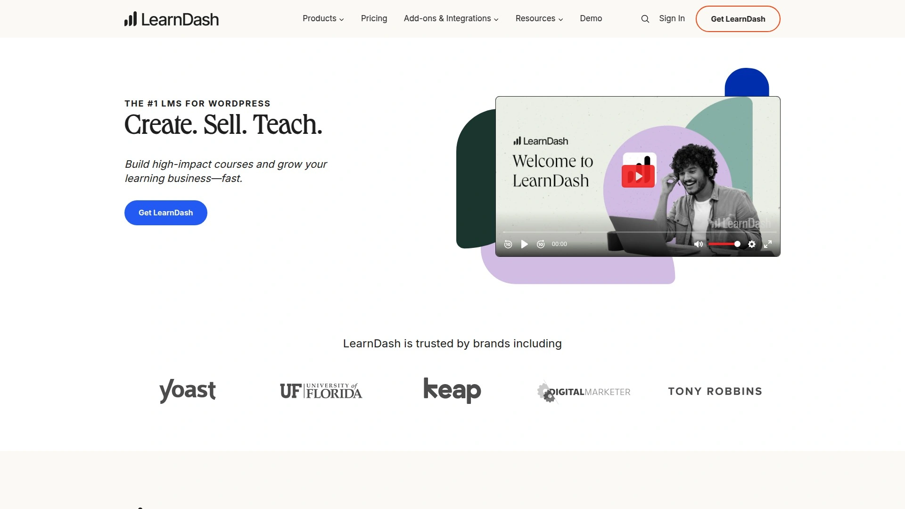

LearnDash adds full LMS functionality to WordPress sites through plugin installation. This approach suits creators and organizations already using WordPress who want course features without migrating platforms. The integration feels native rather than bolted-on.

Drag-and-drop course builder simplifies structuring lessons, topics, quizzes, and assignments. Drip-feed content releases materials over time maintaining engagement. Advanced quiz features include question banks, timed assessments, various question types, and detailed grading. Gamification through badges, certificates, and leaderboards motivates learners.

Integration ecosystem connects WordPress plugins for ecommerce (WooCommerce), email marketing (Mailchimp), video conferencing (Zoom), and automation (Zapier). This flexibility enables customizing tech stack precisely to needs. Payment gateway integration handles course sales.

Detailed reporting tracks learner progress, quiz results, and course performance. Mobile-responsive design ensures courses work on any device. SCORM support imports existing e-learning content. Pricing involves one-time annual fee or monthly cloud hosting making it cost-effective long-term. However, managing WordPress, hosting, security, and updates requires technical comfort.

***

## **[Circle](https://circle.so)**

Community platform with integrated course functionality emphasizing discussions, events, and member connections alongside learning content delivery.

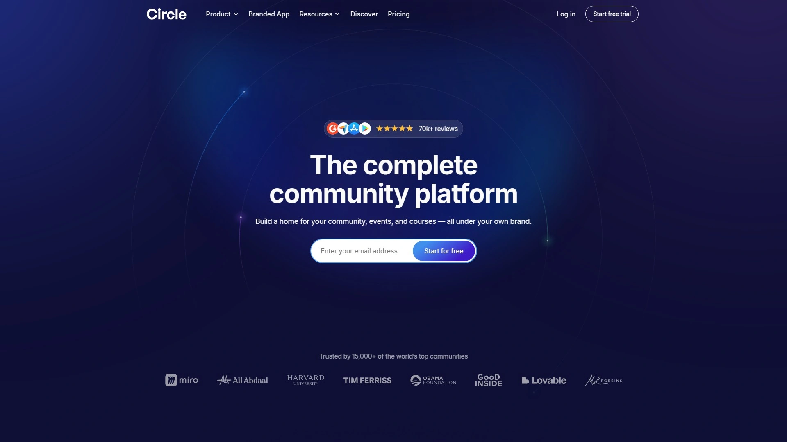

Circle structures communities using Spaces organizing topics, courses, events, chats, and resources. This flexible architecture accommodates diverse community needs beyond just course delivery. Space groups bundle related spaces under themes improving navigation for members.

Course functionality exists within community framework rather than as separate product. This integration keeps learners engaged in community while progressing through lessons. Member interaction includes posts, comments, reactions, and profiles fostering connections. Group chat enables real-time conversations reducing friction compared to asynchronous-only communication.

Event management handles scheduling, registration, and hosting live sessions directly in platform. The unified experience means members don't jump between separate tools for courses, events, and discussions. Moderation tools help maintain community standards. Leaderboards gamify engagement tracking member participation.

However, course authoring tools feel less robust than dedicated course platforms, lacking advanced assessment types and learning path complexity. The focus remains community-first with courses as component rather than centerpiece. Pricing tiers scale with member count and feature needs. Best for creators where community connection drives as much value as course content.

***

## **[Skool](https://skool.com)**

Simplified community learning platform combining courses, discussions, and gamification with clean interface emphasizing ease of use over feature complexity.

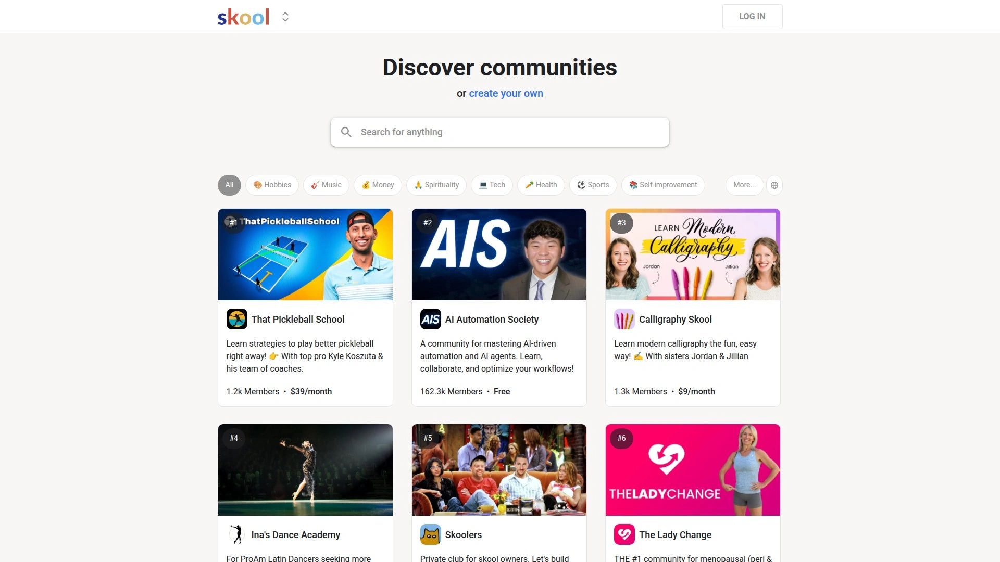

Skool emphasizes simplicity through streamlined interface removing unnecessary complexity. The platform combines course hosting with community discussions and leaderboard gamification in unified experience. This integrated approach eliminates separate tools for courses and community.

Course organization uses straightforward modules and lessons without overwhelming customization options. Discussion forums use simple category structure for organizing conversations. Gamification rewards member participation through points and leaderboards visible to community.

However, organizational tools prove limited compared to platforms like Circle. You can't set space-specific access permissions limiting content gating options. Event hosting capabilities remain basic. The focus on simplicity means power users seeking advanced features may feel restricted.

Pricing follows single-tier structure simplifying decisions though lacking granular options. The all-in-one approach appeals to creators wanting fast launch without decision paralysis. Mobile experience maintains quality enabling engagement anywhere. Best suited for creators prioritizing simplicity and quick setup over maximum flexibility.

***

## **[Articulate 360](https://articulate.com)**

Professional e-learning authoring suite providing desktop and web tools for creating SCORM-compliant training courses with advanced interactivity and multimedia.

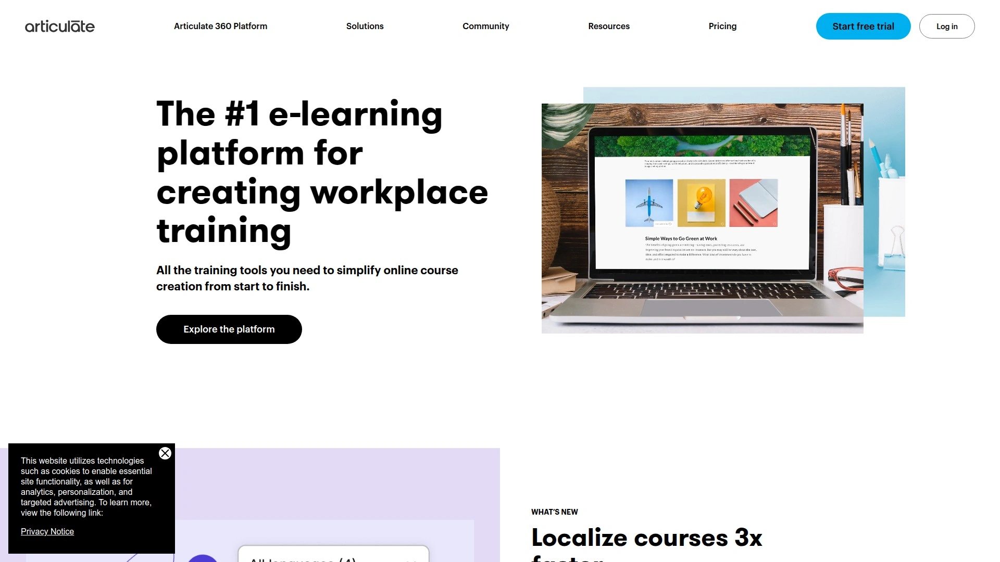

Articulate 360 bundles nine tools including three authoring apps: Storyline 360 for desktop authoring, Rise 360 for web-based creation, and Studio 360 as PowerPoint plugin. This comprehensive suite addresses diverse authoring needs from complex interactions to quick course builds.

Storyline 360 offers PowerPoint-like interface providing flexibility and customization for experienced authors needing advanced interactivity. The desktop tool handles complex branching scenarios, custom animations, and sophisticated assessments. However, it works Windows-only limiting Mac users. Rise 360 provides web-based authoring with responsive templates creating mobile-friendly courses quickly. The simplified interface suits authors with less experience wanting fast course production.

Course templates, stock photos, illustrations, and audio tracks accelerate content creation. Review app facilitates stakeholder feedback and collaboration. SCORM and xAPI compliance ensures courses deploy across learning management systems. Content library provides millions of assets including characters, templates, and interactions.

Pricing involves annual per-user subscription at enterprise rates. The investment suits organizations and professional instructional designers creating numerous courses. Learning curve exists particularly for Storyline though payoff comes through powerful capabilities. Best for training departments and established course businesses requiring professional authoring tools.

***

## **[Absorb LMS](https://absorbtraining.com)**

Enterprise learning platform emphasizing intuitive interface, AI assistance, and comprehensive functionality for compliance, onboarding, and customer training at scale.

Absorb LMS targets enterprise learning and development teams managing complex training programs. The platform handles compliance training, employee onboarding, customer education, and partner enablement through unified system. AI assistance provides intelligent recommendations and automation reducing administrative tasks.

Mobile access through native apps ensures training continuity across devices. Learners engage with content from smartphones and tablets maintaining progress anywhere. The responsive design adapts to various screen sizes without separate mobile content.

Automation capabilities include automatic enrollment based on rules, scheduled reminders, and workflow triggers. These features scale training delivery without proportional staff increases. Reporting and analytics track compliance status, completion rates, and learning outcomes. Integration with HRIS, CRM, and business tools connects learning data to broader organizational systems.

Customization options enable white-labeling learning portals matching corporate branding. Multi-language support accommodates global organizations. SCORM and xAPI compliance ensures content portability. However, enterprise focus means pricing exceeds small business budgets and implementation requires vendor support.

***

## **[Academy of Mine](https://academyofmine.com)**

Specialized LMS for regulated industries needing custom workflows, continuing education credits, and compliance tracking with flexible configuration options.

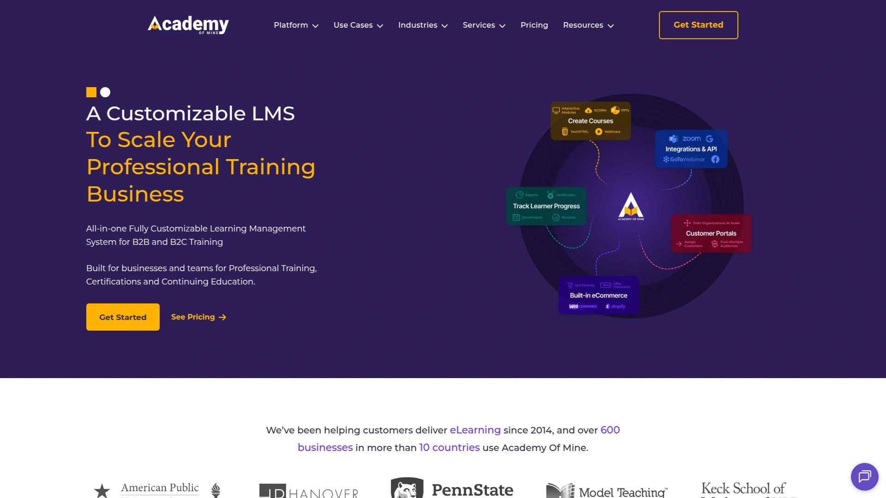

Academy of Mine targets associations, certification bodies, and organizations in regulated industries requiring continuing education management. The platform handles CE credit tracking, certification expiration monitoring, and compliance reporting demanded by professional licensing boards.

Custom workflow capabilities accommodate unique business processes that standardized platforms can't support. Configuration flexibility enables matching platform behavior to organizational requirements. SCORM compliance imports external training content. E-commerce functionality sells courses, certifications, and memberships.

White-label branding creates fully branded learning portals removing Academy of Mine visibility. Custom domains reinforce brand identity. Live session integration connects with webinar and virtual classroom tools. Mobile-responsive design ensures accessibility across devices.

However, pricing starts significantly higher than SMB-focused platforms at $999 monthly reflecting enterprise capabilities and customization. No free trial increases adoption friction. Implementation complexity often requires vendor assistance. Best suited for established organizations in regulated fields needing specialized compliance features.

***

## **[Cornerstone OnDemand](https://cornerstoneondemand.com)**

LMS-LXP hybrid platform for large enterprises emphasizing skill development, career pathing, and AI-driven analytics for workforce upskilling and reskilling.

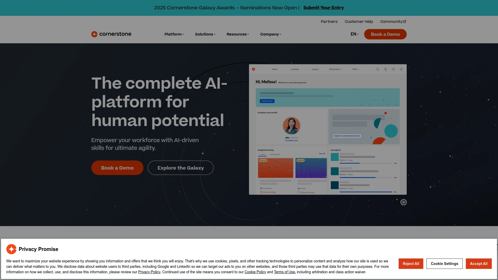

Cornerstone combines learning management with learning experience platform capabilities serving large organizations. Skill mapping identifies competency gaps and recommends personalized learning paths addressing individual needs. AI-driven analytics provide insights into skill development trends and training effectiveness.

Content library includes vast third-party course catalog alongside organizational custom content. Social learning features enable peer knowledge sharing and collaborative learning. The platform emphasizes continuous learning and career development rather than just compliance training.

Integration with talent management systems connects learning to performance reviews, succession planning, and hiring decisions. This holistic approach treats learning as component of broader talent strategy. Mobile access ensures learning happens beyond desktop environments.

Enterprise pricing and complexity mean the platform suits large organizations with dedicated L&D teams rather than small businesses. Implementation timelines extend months requiring substantial organizational commitment. Best for corporations treating learning as strategic initiative tied to business objectives.

***

## **[Blackboard Learn](https://blackboard.com)**

Established academic LMS serving universities and K-12 institutions with comprehensive tools for course management, assessment, and institutional integration.

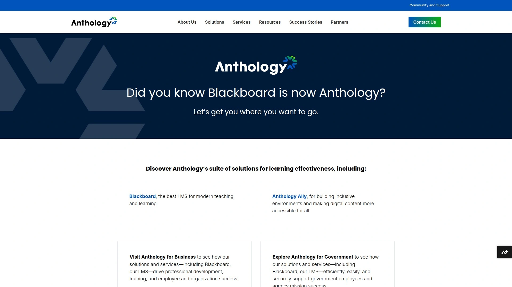

Blackboard dominates higher education and large school district implementations. The platform handles course management at institutional scale serving thousands of concurrent users. Features address academic needs including grade books, assignment submission, discussion boards, and group projects.

Integration with student information systems connects course data to enrollment, transcripts, and administrative functions. This institutional integration streamlines operations for registrars, faculty, and students. Learning analytics track student engagement identifying at-risk learners needing intervention.

Advanced assessment tools include rubric-based grading, peer review, anti-plagiarism detection, and diverse question types. Collaboration features facilitate group work and peer interaction. Accessibility compliance ensures content works with assistive technologies meeting legal requirements.

However, interface feels dated compared to modern platforms and usability receives mixed reviews. Enterprise pricing and complexity exceed individual creator budgets. Best suited for educational institutions rather than individual course creators or businesses.

***

## **[Canvas LMS](https://canvas.instructure.com)**

Modern academic LMS emphasizing user experience and open architecture, popular in K-12 and higher education for intuitive interface and extensive integrations.

Canvas provides more modern interface than legacy academic LMS platforms addressing common usability complaints. The clean design and intuitive navigation reduce training needs for faculty and students. Mobile apps for iOS and Android maintain full functionality beyond desktop.

Open API architecture enables extensive third-party integrations and custom development. The app ecosystem includes tools for video conferencing, plagiarism detection, analytics, and specialized subject content. LTI standard support ensures compatibility with educational tools.

Course management features include assignment submission, grading workflows, discussion forums, and multimedia content delivery. SpeedGrader accelerates assessment with streamlined grading interface. Analytics dashboard tracks student engagement and performance. Mastery Paths customize learning sequences based on assessment results.

Cloud-hosted deployment eliminates institutional server management. Regular updates deliver new features without upgrade projects. However, Canvas remains academic-focused rather than serving independent course creators. Pricing involves institutional licenses beyond individual creator budgets.

***

## **[Tovuti LMS](https://tovutilms.com)**

Interactive learning platform emphasizing gamification, social features, and content authoring tools for creating engaging training experiences.

Tovuti combines LMS functionality with interactive content authoring and social learning features. Built-in course authoring eliminates separate authoring tool needs. The platform creates interactive lessons, assessments, and multimedia content directly within system.

Gamification elements including points, badges, leaderboards, and challenges increase engagement particularly for corporate training. Social learning features like discussion forums, groups, and user-generated content foster collaboration. Live virtual classroom capabilities host synchronous sessions.

E-commerce functionality enables selling courses externally while serving as corporate training platform internally. Payment processing and storefront features accommodate both models. White-label branding creates fully customized learning portals. Mobile apps extend learning beyond desktop.

Reporting and analytics track detailed learner behavior, engagement patterns, and content effectiveness. Integration capabilities connect with business tools through APIs and webhooks. Pricing follows quote-based model varying by user count and features. Best for organizations wanting interactive training without separate authoring tools.

***

## **[Elucidat](https://elucidat.com)**

Cloud-based e-learning authoring platform emphasizing collaboration, template libraries, and fast course production for distributed training teams.

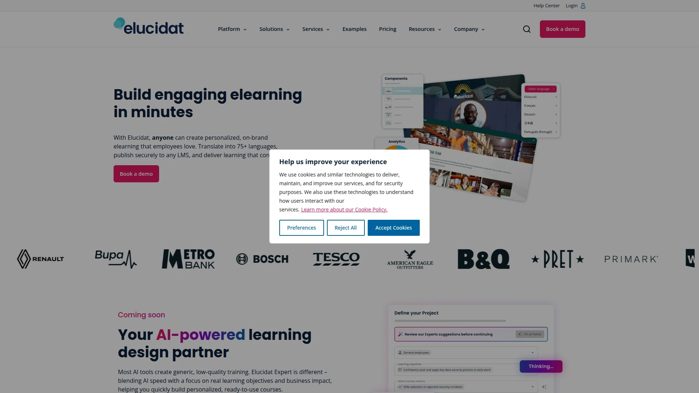

Elucidat provides authoring platform rather than learning management system, focusing on course creation. Large template variety offers starting points for diverse course types reducing design time. The cloud-based collaboration enables multiple team members working simultaneously on projects.

Responsive design ensures courses work across devices without separate mobile authoring. SCORM and xAPI output publishes to any compliant LMS. Translation management streamlines creating multilingual versions. Review and approval workflows coordinate stakeholder feedback.

Analytics provide insights into content performance across organizations identifying effective materials. Version control tracks changes and enables rollback. The centralized library lets teams share and reuse content elements maintaining brand consistency.

Learning curve requires investment though payoff comes through faster production once mastered. Pricing involves custom quotes based on team size and usage. Best suited for training teams and agencies creating numerous courses benefiting from collaborative authoring.

***

## **[Easygenerator](https://easygenerator.com)**

User-friendly e-learning authoring tool designed for subject matter experts without instructional design experience, emphasizing simplicity and speed.

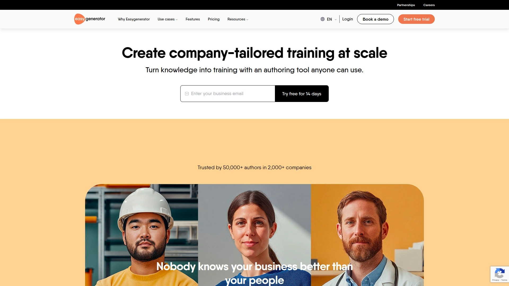

Easygenerator targets non-technical course creators needing straightforward authoring without steep learning curves. The simplified interface guides users through course creation with templates and structured workflows. Subject matter experts create training without instructional design teams.

Mobile-friendly output ensures courses function on smartphones and tablets. SCORM compliance publishes to learning management systems. Collaboration features enable team review and feedback. AI assistance helps generate content and structure.

However, feature limitations compared to professional tools restrict advanced interactions and customization. Assessment capabilities feel basic compared to specialized platforms. The simplified approach trades power for accessibility.

Pricing scales from Pro for individuals through Team and Enterprise tiers. Cloud-based delivery eliminates software installation. Best suited for organizations empowering employees to create training without dedicated instructional design resources.

***

## **[LearningCart](https://learningcart.com)**

Course platform bundling LMS with built-in marketing tools, landing page builders, and email campaigns specifically for course sellers.

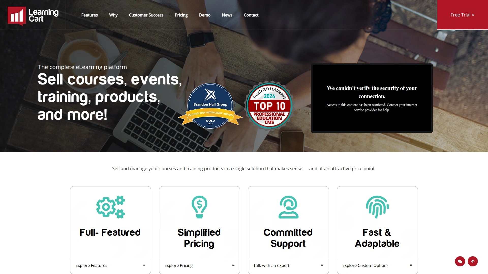

LearningCart combines course hosting with marketing infrastructure targeting creators selling courses as business. Built-in marketing tools include landing page builders, email campaigns, and sales funnel creation. This integration reduces reliance on external marketing platforms.

E-commerce capabilities handle payment processing, subscription management, and course bundles. SCORM support imports existing training content. Custom branding creates white-label learning environments. Live session integration connects with webinar tools.

Pricing starts at $399 monthly positioning between basic platforms and premium options. No free trial increases evaluation friction. The marketing focus suits creators treating courses as primary business versus hobbyists testing waters.

***

## **[DigitalChalk](https://digitalchalk.com)**

Small business LMS offering done-for-you course setup assistance, ideal for teams wanting hands-off implementation support.

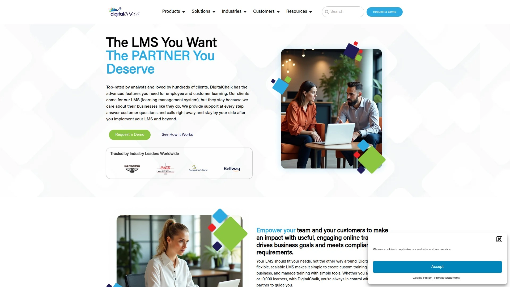

DigitalChalk targets small teams needing turnkey LMS solutions with implementation support. Done-for-you setup service handles initial configuration reducing technical barriers. SCORM compliance imports existing training materials.

E-commerce functionality sells courses externally while serving internal training needs. Custom branding creates professional learning portals. Live session support accommodates virtual classroom training. Mobile access ensures training availability across devices.

Pricing starts around $33 monthly per user making it accessible for small teams. However, per-user pricing escalates quickly as teams grow. No free trial limits risk-free evaluation. Best for small organizations wanting guided LMS adoption.

***

## **[EZ LCMS](https://ezlcms.com)**

Learning content management system specializing in PowerPoint-to-SCORM conversion, ideal for organizations with existing slide-based training materials.

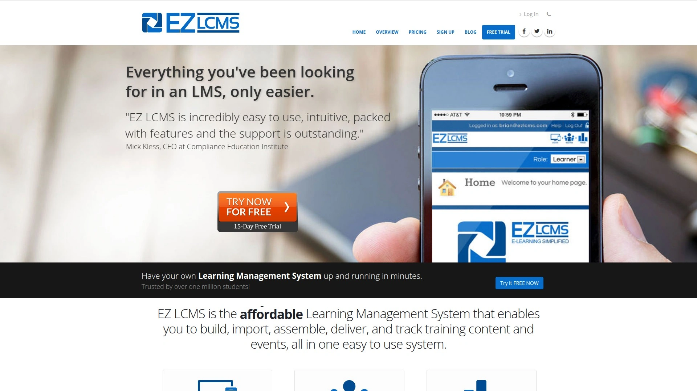

EZ LCMS emphasizes converting PowerPoint presentations into SCORM-compliant e-learning courses. This capability leverages existing slide content rather than rebuilding from scratch. The conversion process maintains formatting while adding interactivity.

SCORM output publishes to any compliant LMS. Custom branding applies organizational identity to converted courses. However, e-commerce capabilities feel limited compared to dedicated course platforms. Live session support lacks depth.

Pricing starts at $199 monthly with free trial enabling testing. Best suited for organizations with PowerPoint-based training materials wanting quick SCORM conversion. The specialized focus means general course creators likely find better options elsewhere.

***

## **[LearnUpon](https://learnupon.com)**

Enterprise LMS emphasizing multi-portal management for organizations training different audiences through separately branded learning environments.

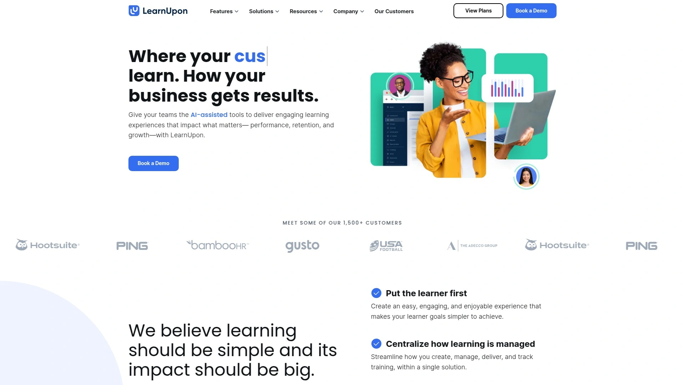

LearnUpon specializes in managing multiple branded portals from single admin interface. This multi-tenancy suits organizations training employees, customers, and partners through separately branded experiences. Each portal maintains unique branding, content, and user management.

SCORM compliance imports external content. E-commerce functionality sells courses externally. Custom branding creates professional learning portals. Live session integration supports virtual training. Mobile access ensures learning continuity across devices.

Reporting spans individual portals and aggregates across organization providing comprehensive insights. Integration capabilities connect with business systems. However, custom pricing and lack of free trial increase evaluation barriers. Best for established organizations managing complex training across multiple audiences.

***

## **[Thought Industries](https://thoughtindustries.com)**

Learning commerce platform for scaling training businesses with advanced storefronts, flexible monetization, and customer education focus.

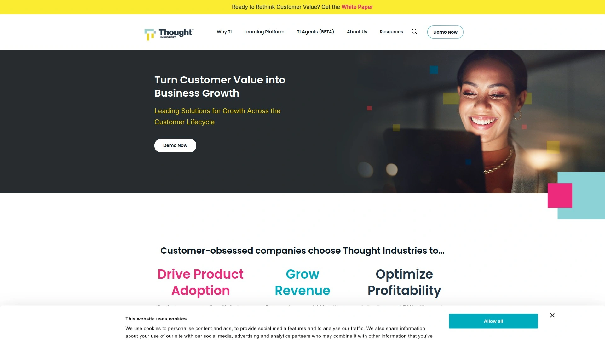

Thought Industries targets organizations monetizing learning through customer and partner training programs. Advanced storefront capabilities include product bundling, subscription management, and flexible pricing structures. The platform treats courses as products sold externally.

SCORM compliance imports existing content. E-commerce functionality handles complex billing scenarios. Custom branding creates professional learning destinations. Live session support accommodates virtual training. Mobile apps extend learning beyond desktop.

However, enterprise focus means custom pricing and implementation requiring vendor involvement. No free trial limits hands-on evaluation. Best suited for established organizations treating learning as revenue center through customer and partner training.

***

## **[Google Classroom](https://classroom.google.com)**

Free education platform integrated with Google Workspace, designed for K-12 schools and educational institutions managing assignments and classroom communication.

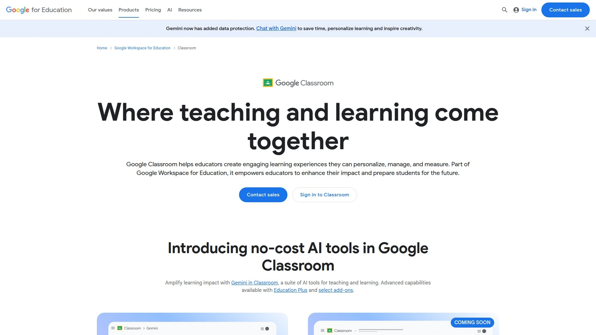

Google Classroom serves educational institutions particularly K-12 schools and non-profits. The platform integrates seamlessly with Google Drive, Docs, Sheets, and other Workspace tools. Teachers create assignments, distribute materials, and collect submissions through unified interface.

Features include assignment management, grading workflows, announcement posting, and student communication. Google Meet integration facilitates virtual classes. The mobile app extends classroom management beyond desktop.

Completely free pricing makes it accessible for schools with limited budgets. However, functionality focuses on classroom management rather than comprehensive course creation. Limited customization and branding options reflect the free educational focus. Best suited for schools using Google Workspace rather than individual course creators.

***

## FAQ

**Which course platform works best for complete beginners with no technical experience?**

Teachable and Thinkific both offer beginner-friendly interfaces with guided setup processes that walk you through course creation step-by-step. Teachable emphasizes simplicity with pre-built templates and straightforward navigation, while Thinkific provides more flexibility without overwhelming complexity. Both platforms include free plans or trials letting you test before committing financially. For creators wanting absolutely minimal technical decisions, Teachable's guided approach reduces decision paralysis, though Thinkific's zero transaction fees save money long-term once you start generating sales.

**How do all-in-one platforms like Kajabi compare cost-wise to combining separate tools?**

Kajabi starts at $119 monthly but bundles course hosting, email marketing, sales funnels, landing pages, and payment processing that separately might cost $50-100 for course hosting, $30-50 for email service, $100+ for funnel builders, and transaction fees totaling $200-300 monthly. Many creators report saving $300+ monthly by consolidating tools. However, if you need basic course hosting without advanced marketing automation, platforms like Thinkific at $49 monthly or Podia at similar pricing with simpler marketing tools prove more economical. Evaluate whether you'll actually use Kajabi's full feature set before paying premium pricing.

**What's the difference between marketplace platforms like Udemy versus independent course platforms?**

Marketplace platforms like Udemy, Coursera, and Skillshare provide built-in student audiences eliminating cold-start marketing challenges but limit pricing control, branding, and student relationship access. You can't collect student emails, control discount timing, or customize course pages significantly. Independent platforms like LearnWorlds, Teachable, and Thinkific require building your own audience but grant complete pricing freedom, unlimited branding customization, direct student relationships, and typically higher profit margins since you're not sharing revenue beyond payment processing fees. Choose marketplaces for quick passive income without marketing effort, or independent platforms when building a branded course business.

***

## Conclusion

Online course platforms have democratized education and training by providing complete infrastructure for creating, marketing, and delivering learning experiences without technical expertise or massive budgets. The 28 platforms reviewed here range from beginner-friendly options like Teachable and Thinkific through community-focused solutions like Mighty Networks and Circle, to enterprise systems like Docebo and Absorb LMS serving thousands of concurrent users. Whether you're an independent creator launching your first course, a business training employees, or an institution managing academic programs, modern course platforms deliver functionality matching your specific needs and budget. For creators prioritizing interactive learning experiences with sophisticated engagement tools beyond basic video delivery, [LearnWorlds](https://www.learnworlds.com) stands out through its unique interactive video capabilities, customizable course player, and built-in social learning features that transform passive watching into active engagement—making it the ideal choice when student completion rates and knowledge retention matter as much as content quality itself.
